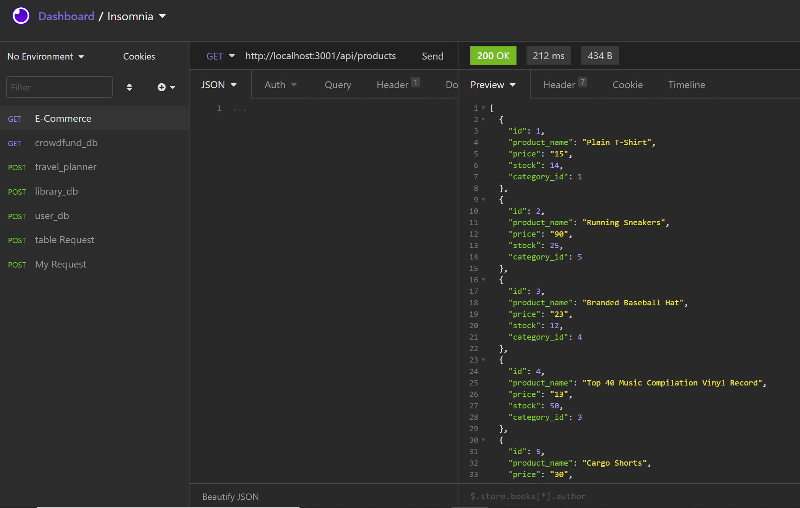

# E-Commerce-DB

## Summary
This app uses express, sequelize, and seeding to create an e-commerce database. The user can select all, select by id, update, and delete table items. The data is presented as json, and all commands with the database are through Insomnia.
